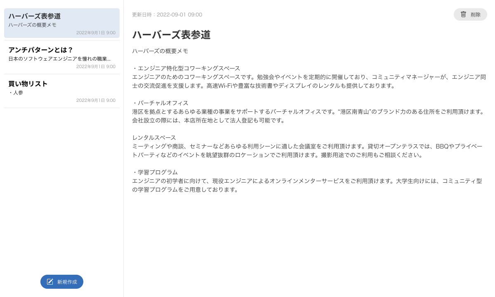

# 実践課題

下記のようなメモアプリを作成します。

[Figmaのデザインファイル](https://www.figma.com/file/C3GCHbPqQRZSCKWmnKMr3U "Figma")




各ディレクトリは下記のようになっています。  
課題を行う際は、`/react`ディレクトリを使って下さい。

| ディレクトリ           | 内容                            |
|------------------|-------------------------------|
| /react           | 課題作成用ディレクトリ                   |
| /api              | サーバーサイド(REST API，GraphQL API) |
| /docker           | Docker環境                      |
| /react-ui         | (実装サンプル)11〜12週目の実装サンプル        |
| /react-ui-graphql | (実装サンプル)14週目の実装サンプル           |
| /react-ui-rest    | (実装サンプル)16週目の実装サンプル           |


実際に、メモアプリがどのように動作するかは、下記URLを参考にして下さい   
[http://localhost/ui-sample/index.html](http://localhost/ui-sample/index.html)  
※環境構築後アクセス可能


----

# 【11〜12週目】ノートアプリ作成(1)


## 1. 環境構築

### 1-1. mainリポジトリをクローン

```shell
git clone https://github.com/posse-ap/react-note.git
```

### 1-2. Docker環境を起動

```shell
cd react-note
docker-compose up -d

; api(laravelの設定、初期データの作成)
docker-compose run react-note-web bash -c 'cd api && composer install && php artisan migrate:fresh --seed'
```


## 2.ノートアプリの作成

Reactハンズオンラーニング4〜7章では、StarRatingコンポーネントの作成を通じて、

- 要素とコンポーネントの基礎
- JSXの
- ステート管理
- コンテキスト
- フック

等の使い方を学んできました。  
これらの復習を兼ねて、ノートアプリを作成してみましょう。


### 2-1. React環境の起動

開発は、`/react`ディレクトリを使います。


```shell
; コンテナ内に入る
cd react-note
docker-compose exec react-note-web bash

; reactディレクトリに移動
cd react

; ライブラリのインストール
npm install

; reactの開発モードを開始
npm run start
```

reactの開発モードを起動すると、下記URLでアクセスできます。

> http://localhost:3000  
> ※httpsでは無いことに注意


### 2-3. 早速作る

`/react/src`ディレクトリを好きなエディター作ってみましょう！

プロジェクトに必要な画像やサンプルデータは用意してあります。


| ファイル        | 内容               |
|-----------------|------------------------|
| App.js          | Reactのメインファイル  |
| iconAdd.svg     | (アイコン画像)追加     |
| iconDelete.svg  | (アイコン画像)削除     |
| note-data.json  | サンプルデータ         |


----

## 【14週目】ノートアプリ作成(2) 外部連携:REST

Reactハンズオンラーニング8章1〜8章5で勉強した内容の復習です。  


「【11〜12週目】ノートアプリ作成(1)」では、JSONファイルからデータを取得していましたが、  
REST APIからデータを取得するように修正しましょう。

修正内容は、下記です。

- データをREST APIから取得してノート一覧を表示
  - 利用するAPI: http://localhost/rest/note
- 一覧で選択したノートを右側の編集エリアに表示
  - 利用するAPI: http://localhost/rest/note/{noteId}

<span style="color: red;">※「新規作成」「削除」機能は、8章で学習する範囲を超えているので実装しなくてOKです。</span>


APIドキュメントは下記に用意してありますので、参考にして下さい。  
http://localhost/rest

----

## 【16週目】ノートアプリ作成(2) 外部連携:GraphQL


| 作業ブランチ  | 実装サンプルブランチ |
|---------|------------|
| 14週目の続き | ui-graphql |


Reactハンズオンラーニング8章6で勉強した内容の復習です。

「【14週目】ノートアプリ作成(2) 外部連携:REST」では、REST APIからデータを取得していましたが、  
GraphQL APIからデータを取得するように修正しましょう。


修正内容は、下記です。

- データをGraphQL APIから取得してノート一覧を表示
  - ```graphql
    # クエリサンプル
    query {
      notes {
        id
        title
        body
      }
    }
    ```
- 一覧で選択したノートを右側の編集エリアに表示
  - ```graphql
    # クエリサンプル
    query($noteId:ID) {
      note(id: $noteId) {
        id
        title
        body
      }
    }
    ```

<span style="color: red;">※「新規作成」「削除」機能は、8章で学習する範囲を超えているので実装しなくてOKです。</span>

APIドキュメントは下記に用意してありますので、参考にして下さい。  
http://localhost/graphiql
